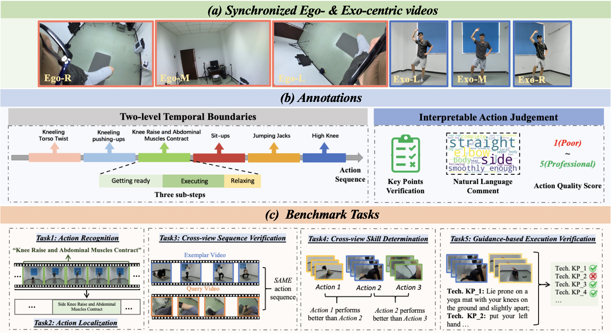

# 
EgoExo-Fitness: Towards Egocentric and Exocentric Full-Body Action Understanding

### 
*Yuanming Li, Weijin Huang, Anlan Wang, Lingan Zeng, Jingke Meng, Weishi Zheng*

#### 
[[Paper w/ Appendix]](https://arxiv.org/abs/2406.08877) 

Official repository of paper "EgoExo-Fitness: Towards Egocentric and Exocentric Full-Body Action Understanding"

All resources will be available soon. Please feel free to contact us if you have any question.

**Contact:** 
- Email: yuanmingli527@gmail.com / liym266@mail2.sysu.edu.cn
- WeChat: Liymmmmmme

## 💬 News
- [2024.06.13] The repository is created.
- [2024.06.14] The preprint paper is available.
- [2024.06.25] Cross-View Sequence Verification benchmark code is available.

## :paperclip: Abstract
We present **EgoExo-Fitness**, a new full-body action understanding dataset, featuring fitness sequence videos recorded from synchronized egocentric and fixed exocentric (third-person) cameras. Compared with existing full-body action understanding datasets, EgoExo-Fitness not only contains videos from first-person perspectives, but also provides rich annotations. Specifically, two-level temporal boundaries are provided to localize single action videos along with sub-steps of each action. More importantly, EgoExo-Fitness introduces innovative annotations for interpretable action judgement--including technical keypoint verification, natural language comments on action execution, and action quality scores. Combining all of these, EgoExo-Fitness provides new resources to study egocentric and exocentric full-body action understanding across dimensions of **what**, **when**, and **how well**. To facilitate research on egocentric and exocentric full-body action understanding, we construct benchmarks on a suite of tasks (\ie, action recognition, action localization, cross-view sequence verification, cross-view skill determination, and a newly proposed task of guidance-based execution verification), together with detailed analysis.

 
